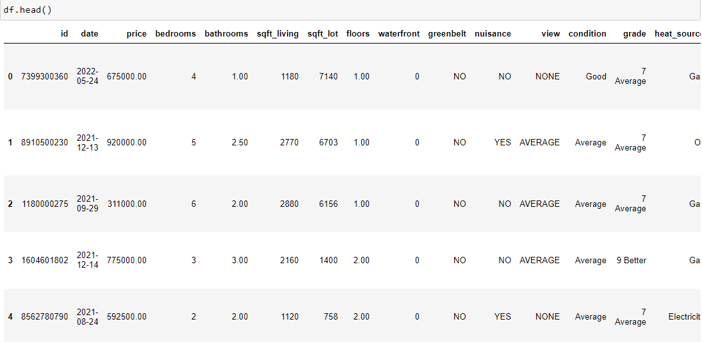
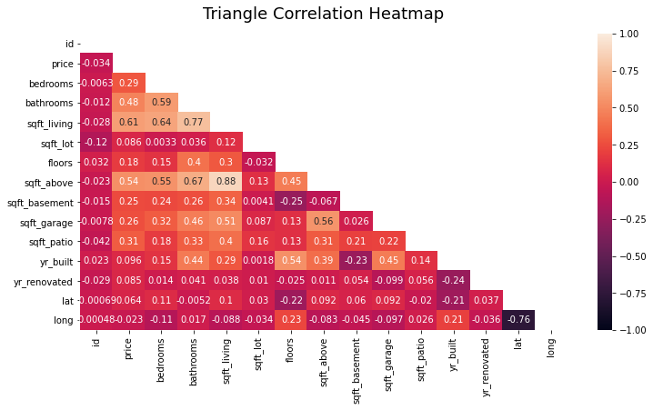
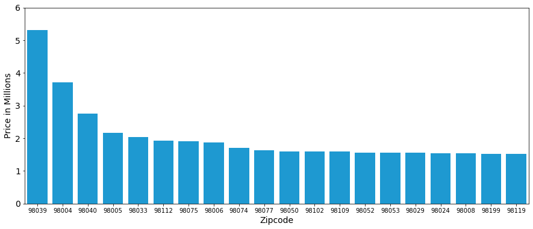
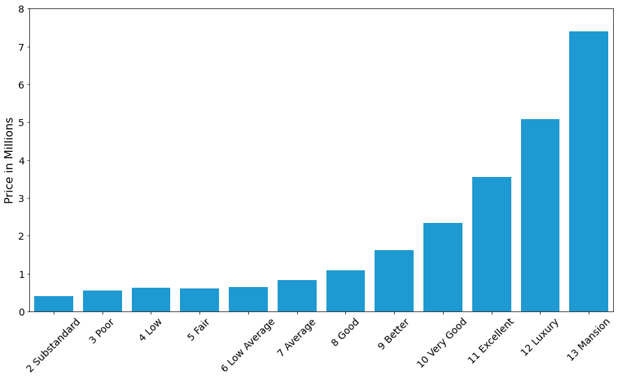
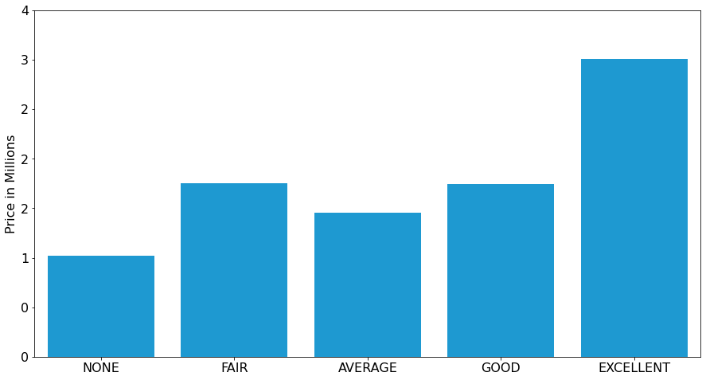
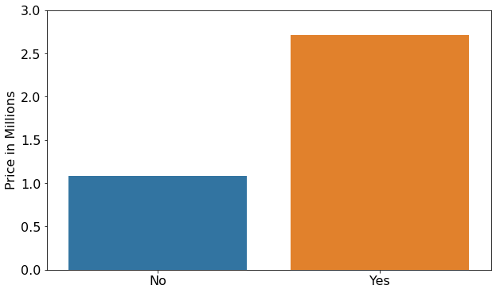
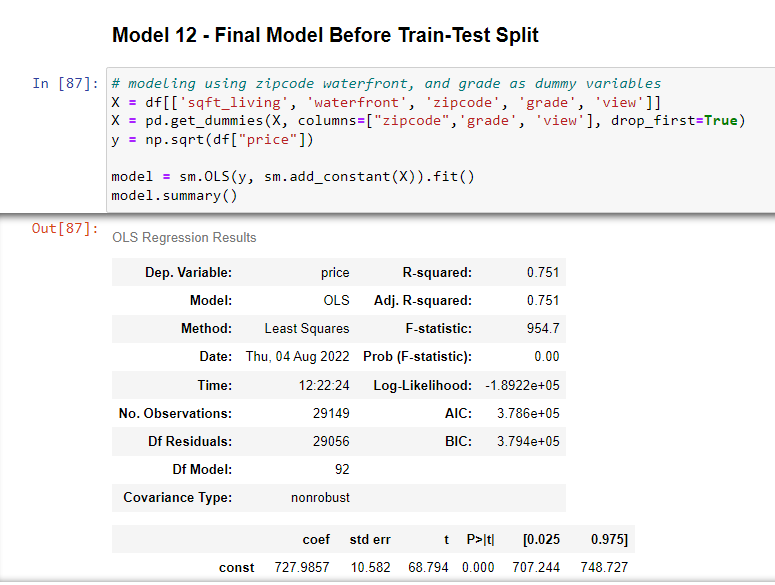
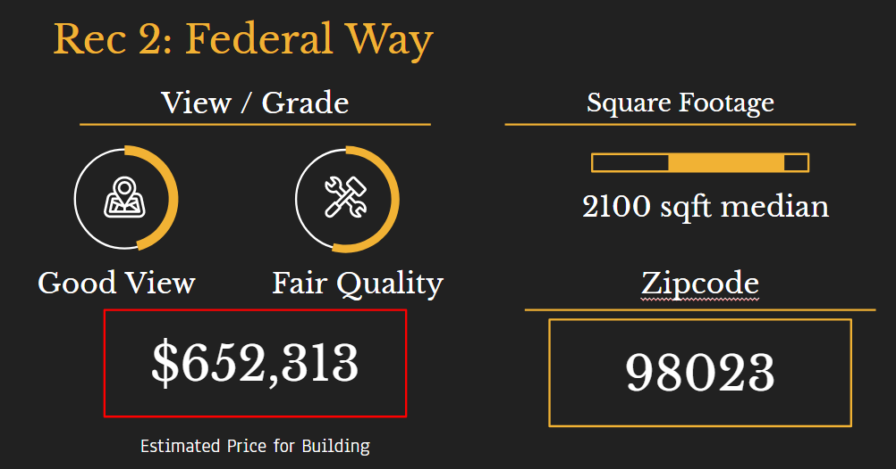

# Predicting Seattle Housing Prices

## Project Overview

In this project, we have been tasked to analyze the King County, Washington real estate data and provide a business problem as well as a solution based off the data set. Our business problem is that we have a 'client' whos goal is to buy a real-estate lot for the purposes for producing a 3-D Model Home for advertising purposes. They are looking for a real-estate with a great view, poor house condition (for easy tearing down purposes), good location (for decent re-sell value), and a reasonable price estimate. Our primary objective is to offer three recommendations based off our findings, and our secondary objective is to analyze key components in the data that would lead to the three recommendations.

### Approach

We will go attempt to achieve our primary objective in 3 steps.

1. Exploratory Data Analysis (EDA): We will look and analayze the entire data set, and explore the purpose and relation each column has with each other as well as the primary objective. Afterwards, we will trim the unnecessary information, remove or fill null values, convert data from strings to numeric datatypes, investigate correlation through a heat map to find good predictors of price, and create necessary charts to demonstrate relationship or trends in the data/market.

2. Variable Selection: Similar to the prior step, this is where we use the correlation heatmap as well as personal knowledge on the market to pick the dependent and independent variables for our objective. The dependent variable will be price as no other variable is as important since our client has no interest in other features if the price is unreasonable. The independent variables we have chosen based off the heat map were zipcode (location), whether the property has a waterfront or not, square footage of living space, the build quality/grade of the building, and the view. Zipcode has a huge impact on the price and should definitely be on the list as no one wants to spend five million dollars to live in the sticks. Waterfront had a huge impact on the price, and while waterfront increases the price of the property by a lot; we deemed it unnecessary as the cost was a bit too high for our client. The square footage of living space also impacts the price since more land more money, but more importantly we had to find locations with a decent count of larger homes. The build quality of the home also affected price but mostly excellent built homes were well above the cost of others; in our case, we chose lower quality homes for lower-cost basis and easier tear-down. The view was the last variable as our client was looking to use the house for promotional material for their business.

3. Model Accuracy - Our variables we chose had a clear impact on price and we chose to build our model off that. With price as the dependent variable, our model had a R-squared of .751. This means that our model was able to account for 75.1% of the total house market which was decent enough for us. We ran a train-test-split from the model and came out with a lr.score (confidence score) of .747, a mean absolute error of 10,373.82, and a mean squared error of 26335.73. This shows that our training model has a margin of error of around $10,307 dollars.

### The Data

This project uses the King County House Sales dataset, which can be found in  `kc_house_data.csv` in the data folder in this assignment's GitHub repository. Below are the columns in the data set.

* `id` - Unique ID of the house
* `date` - Date the house was sold
* `price` - Price the house was sold at (Prediction Target)
* `bedrooms` - The number of bedrooms
* `bathrooms` - The number of bathrooms
* `sqft_living` - Square footage of living space
* `sqft_lot` - Square footage of the entire lot
* `floors` - Number of floors
* `waterfront` - Whether the house has a waterfront or not
* `greenbelt` - Whether the house has a greenbelt or not
* `nuisance` - Whether the house has a nuisance nearby or not
* `view` - The grade/quality of the view (None/Average/Good/Fair/Excellent)
* `condition` - The condition of the house (Poor/Fair/Good/VGood/Average)
* `grade` - Overall grade based off house build quality (1-12) 
* `heat_source` - The type of heat source the house has (Gas/Oil/Electricity)
* `sewer_systen` - Whether the sewer system is public or private
* `sqft_above` - Square footage above ground
* `sqft_basement` - Square footage in the basement
* `sqft_garage` - Square footage of the garage
* `sqft_patio` - Square footage of the patio
* `yr_built` - The year the house was built
* `yr_renovated` - The year the house was renovated
* `address` - Address
* `lat` - Latitude
* `long` - Longitude

### Findings and Conclusion

The following chart indicates the total real estate sale total by month. The purpose of the graph is to find the best timing of highest house availability assuming that house sales ties with house availability. January and February have the lowest sales, alongside with December. July and August have the highest sale total and relatively every month besides the prior three seem like a great time to buy.

The following chart above is a correlation heatmap to indicate how closely correlated all the variables are to each other. From there, we mostly looked at the price correlations to find which variables would impact the price the most. From there, we had to also pick variables that our client would look at and would be highly relevant to the business goal. There's no point in picking variables that have high correlation but have no actual impact on the business decision itself.

This chart just indicates that zipcode has a large impact on the price of homes. There were a lot more than the amount of zipcodes shown so we had to limit the amount of zipcodes displays. Zipcode is one of our independent variables.

This chart indicates that grade has a large impact on the price of homes.\
Grade is one of our independent variables.

This chart indicates that grade has a large impact on the price of homes.\
View is one of our independent variables.

This chart indicates that waterfront has a large impact on the price of homes.\
Waterfront is one of our independent variables.

### Final Model Description

It is important to note for this model we transformed the price of homes to be the square root of the price of homes. We did this to normalize the distribution of price because it is originally skewed right. We experimented with transforming it to the log of price but we ultimately found the square root of the price to work better for our model.

Our final model includes the following features: square foot of living space, zip code, whether it is a waterfront property, grade of construction, and view. Square foot of living space is the only continuous variable in our model. Waterfront was the only binary categorical variable in our model. For the rest of the features we transformed them into dummy variables.

Our model has a p-value of the f-statistic of close to 0 which means we can reject the null hypothesis of our model having no significance in predicting the price of a home. We achieved an R-squared value of 0.751 which means our model explains about 75% of the variation in price using our features. The mean absolute error and mean squared error after squaring them are 10,248.87 and 25,479.47 respectively. This means our model on average has a margin of error of about $10,248 when predicting home prices.

### Recommendations

Based on our findings for the zipcodes they could be interested in, we have narrowed down 3 zipcodes that could be useful to them based on their budget and other business objectives.

The 3 zipcodes we recommend are 98023, 98022, and 98199.

1. For the 98023 zipcode, this zipcode location is known as Federal Way and is our first recommendation. This would be a good option for a cheap home in an upcoming neighborhood outside of Seattle.

2. For the 98022 zipcode, this ziopcode location is known as Enumclaw and is our seconc recommendation. This zone gives you scenic views of Mt. Rainier. The negative being this is outside of Seattle and could limit the amount of people coming to see your model home.

3. For the 98199 zipcode, located in the heart of Seattle; our last recommendation is this prime location for gathering investors with views of Elliot Bay and Seattle. Any real estate here will surely generate value over time.

### Wanting to contribute?

If you are interested in contributing to our study (Please don't):

Fork this repository\
Clone your forked repository\
Add your scripts\
Commit and push\
Create a pull request\
Star this repository\
Wait for pull request to merge\
Allow us to review your contribution\

Repository Structure

├── README.md <- The README for reviewers of this project\
├── 01-Data_Cleaning.ipynb <- Documentation of the analysis process in Jupyter notebook\
├── 02-EDA_and_Regression_Model <- The presentation in PDF\
├── Data <- Both sourced externally and generated from code\
└── vis <- Storage for all images used\
